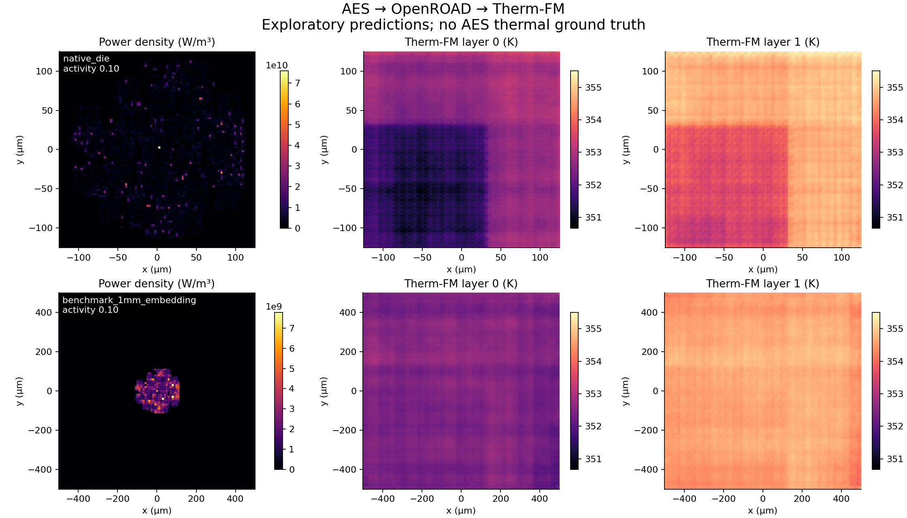
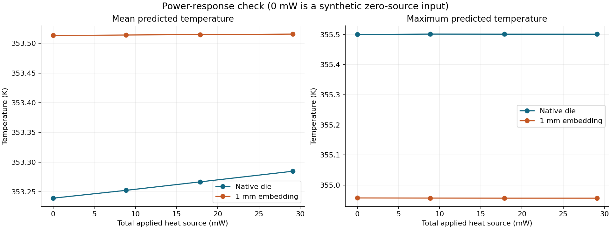

# AES → OpenROAD → Therm-FM: results and bottlenecks

Date: 2026-09-29, Asia/Kolkata.

## Outcome

**The end-to-end execution succeeded.** A real AES RTL design was synthesized, placed and routed; per-cell power was exported from OpenSTA using extracted parasitics; eight checkpoint-compatible thermal inputs were generated; actual trained Therm-FM weights produced finite temperature maps.

**The temperatures are not validated AES temperatures.** The strongest finding is that checkpoint/package compatibility and physical input provenance are much more limiting here than inference speed. This run deliberately did not hide that mismatch through arbitrary power rescaling, fabricated ground truth, or training on synthetic labels.

## What ran

- Design: ORFS `aes_cipher_top`, OpenCores-derived AES hardware RTL.
- Platform: Nangate45 typical Liberty and physical technology files.
- Execution: existing remote Linux L40S host, isolated `/home/ubuntu/aes_thermfm_20260929` directory. Existing Therm-FM source/checkpoints were read, not edited.
- Physical design: official ORFS container pinned to `sha256:94d3c1c19b47e8ef2c3a9b32cb9dc6e5c18817ffb71f03e28ec67d6fa0a44512`; 4 CPU / 8 GB container limit.
- Thermal model: user's IND-8C-trained Therm-FM-T, GW-L2 alpha 0.5 (`p=7`), 101×101 resolution, 8 input channels, 2 output channels. This is an existing experiment checkpoint, not a claim of reproducing the unmodified paper model.
- No AES fine-tuning or transient simulation was done.

## Physical-design results

| Item | Observed result |
|---|---:|
| Die width × height | 249.85 × 250.60 µm |
| Physical instances including fillers/taps | 32,004 |
| Reported standard-cell count | 14,872 |
| Filler cells | 17,132 |
| Macros | 0 |
| Clock constraint | 0.82 ns |
| Final setup worst slack | -0.0380276 ns |
| Final setup violation count | 19 |
| Final hold worst slack | +0.10568 ns |
| Detailed-router final DRC errors | 0 |
| Router antenna-violating nets/pins | 0 / 0 |
| Sum of flow-reported stage elapsed times | 365 seconds |
| Flow-reported peak memory | approximately 1,123 MB |

The design is routed, but it is **not timing-closed** at the chosen constraint. Router DRC success is not foundry sign-off; no independent sign-off DRC/LVS or AES functional certification was performed.

Actual final DEF, ODB, GDS, SDC, mapped Verilog, and SPEF are saved under `flow/results/nangate45/aes/base/`. Stage logs/reports and metric JSONs are saved alongside them.

## Electrical power inputs

Power was recomputed with explicit vectorless global/input activity and duty 0.5. Each cell's internal + switching + leakage estimate was assigned uniformly to its placed footprint.

| Activity per clock cycle | Sum of cell power |
|---|---:|
| 0.02 | 8.865363 mW |
| 0.10 | 17.855389 mW |
| 0.20 | 29.092921 mW |

At activity 0.10, design-level internal/switching/leakage totals are approximately 9.2362 / 8.1584 / 0.4608 mW. Cell sums match the design report within floating-point aggregation tolerance. All 32,004 physical instances were exported; zero-power physical cells are retained in the CSV but contribute no heat.

**Activity is a major bottleneck.** The stock flow's default final power report is 0.434837 W, approximately 24× the deliberate activity-0.10 estimate. The reports use different activity assumptions. Neither is validated against an AES switching trace. Use `outputs/power_0.10.rpt` for the activity-0.10 thermal input; do not accidentally substitute the stock flow power report.

## Therm-FM adapter and checks

The eight cases are three activity levels plus an all-zero-source diagnostic, each at:

1. Native routed die dimensions.
2. A hypothetical 1 mm square thermal die with the same AES cell footprints centered inside it. This embeds, rather than stretches, the design and preserves total watts.

Assumptions: AES source in layer slot 0, zero source in layer slot 1; 200 µm source thickness; x/y represented in mm; z values are the industrial checkpoint's identifiers 1/2. Package/cooling behavior stays implicit in checkpoint weights. See `docs/THERMAL_ASSUMPTIONS.md` for the limitations.

- Tensor stored in `inputs/thermfm/input.mat`, dataset `data`, shape **(8, 4, 2, 101, 101)**.
- Channel order verified from actual data: first field, x, y, z/layer identifier; the first field is interpreted as volumetric heat source for the industrial adapter. Its exact generator scaling still requires confirmation.
- Conversion to model input: permute to `(N, layer, physical_channel, H, W)`, then flatten to `(N, 8, 101, 101)`.
- Use original checkpoint input/output normalization; never recompute normalization on these eight samples.
- All cell power values and model inputs/outputs are finite; all source powers are nonnegative.
- Exact rectangle-overlap rasterization conserves power. Maximum density-integral error across cases: **3.47e-18 W**.
- No missing, unexpected, or mismatched checkpoint keys were reported.
- Prediction shape: **(8, 2, 101, 101)**, saved in both `.npy` and HDF5 `.mat` formats.
- No invented target temperatures or `output.mat` were supplied.
- Replaying with archived model source and checkpoint produced bitwise-identical predictions. Nine artifact-integrity checks pass; results are saved in `outputs/verification.json`.

## Source-domain sanity check

Before AES, sample 999 from the IND-8C source dataset was run with the same inference code, checkpoint and statistics. It belongs to the held-out end of the dataset under the documented 90% train+validation split.

| Metric on this one sample | Result |
|---|---:|
| MAE | 0.022671 K |
| RMSE | 0.031252 K |
| Global maximum absolute error | 0.393386 K |

These support correctness of model loading and normalization on its original data. They do not measure AES accuracy and are not a full benchmark evaluation.

## AES predictions and diagnostic result

Means below are simple grid/output-layer averages for diagnostics, not volume-weighted physical averages. Peaks are maxima over both output layers.

| Domain | Applied power | Mean prediction | Peak prediction | Mean change from same-domain zero source |
|---|---:|---:|---:|---:|
| Native | 0 mW diagnostic | 353.23943 K | 355.50064 K | — |
| Native | 8.86536 mW | 353.25263 K | 355.50176 K | +0.01321 K |
| Native | 17.85539 mW | 353.26688 K | 355.50155 K | +0.02745 K |
| Native | 29.09292 mW | 353.28475 K | 355.50149 K | +0.04532 K |
| 1 mm embedding | 0 mW diagnostic | 353.51327 K | 354.95714 K | — |
| 1 mm embedding | 8.86536 mW | 353.51401 K | 354.95676 K | +0.00074 K |
| 1 mm embedding | 17.85539 mW | 353.51471 K | 354.95646 K | +0.00143 K |
| 1 mm embedding | 29.09292 mW | 353.51557 K | 354.95641 K | +0.00230 K |

The zero-source input itself produces a structured temperature field. Added AES heat changes that field only weakly. Some point predictions decrease slightly when heat is added, and the predicted peaks are not consistently increasing with power. These changes are small compared with the source-domain prediction error; they are diagnostic concerns, not a quantified proof of a particular physical defect.

The selected model's absolute temperature offset reflects its learned benchmark. We do not know the correct zero-power AES temperature because a matching physical package/cooling reference was not established. Do not interpret the roughly 353 K level as an independently justified AES operating temperature.

At activity 0.10, the hypothetical 1 mm embedding changes the mean prediction by only 0.00143 K from zero source. Its hotspot location is essentially unchanged from zero source. A visually plausible heatmap therefore cannot serve as evidence of accurate new-design thermal prediction.

## Inference cost

- L40S GPU, batch size 1, float32, inference mode.
- Median synchronized forward time after warm-up: **27.64 ms per sample**.
- Maximum over the eight measured forwards: 28.73 ms.
- Model-load time in this run: approximately 0.66 seconds.
- Peak PyTorch allocated memory during inference: 111,268,864 bytes (approximately 106 MiB). This excludes driver/context memory and is not total GPU occupancy.
- These timings exclude OpenROAD, input preparation, file loading, hashing and initial warm-up. They are not end-to-end design turnaround times.

## Bottlenecks before scaling

| Bottleneck | Evidence from this run | Next concrete action |
|---|---|---|
| Power/activity validity | Stock report and explicit activity report differ by ~24× | Simulate representative AES workloads; annotate VCD/SAIF activity and confirm clock/power units |
| Thermal stack not supplied by OpenROAD | Need assumed source thickness, second layer, package and cooling | Define the target stack, material properties, interfaces and boundary conditions explicitly |
| Dataset physical conventions | HotSpot and industrial coordinates/source magnitudes differ drastically | Recover original dataset-generation scripts and confirm the first-channel unit/scaling and z-order |
| Checkpoint geometry/domain transfer | Source sample accurate; new AES output mostly follows its zero-source pattern | Generate target-stack thermal references; evaluate zero-shot first, then fine-tune with a small real simulation set |
| Spatial scale | Native die is about 0.25 mm versus a 1 mm checkpoint domain; fixed grid loses source detail under embedding | Test resolution and package conditioning with matched thermal targets |
| No reference temperature | AES has no matched HotSpot/FEM labels | Run a thermal solver using the same source map and explicitly defined stack; then report AES error |
| Inference API expects datasets in common scripts | Standard loader requires both input and output files and split logic | Retain a dedicated label-free interface like `scripts/infer.py` |
| Reproducible tooling | OpenROAD/Yosys report unknown build hashes | Pin image digest; archive technology, RTL, configs, logs, source, weights and normalization |
| Timing closure | 19 setup violations, worst -38 ps | Relax the clock or repair timing before claiming a deployable AES implementation |
| Storage | Existing remote disk reached ~94% used after installing ORFS | Budget dataset/checkpoint storage before larger sweeps; no existing data was deleted |

## Recommended next experiment

Keep this AES netlist/layout, obtain workload-based activity, and choose one physically explicit stack. Generate a modest set of reference thermal solutions for varying AES powers on that stack. Evaluate the existing checkpoint and then target fine-tuning against the same held-out cases. That isolates the real question—whether a pretrained thermal representation adapts economically—without confusing input-format success with thermal accuracy.

## Sources and provenance

- [Therm-FM paper, framework and physical setup](https://arxiv.org/html/2605.22663v2#S3).
- [Official Therm-FM code](https://github.com/haiyangxin/Therm-FM); executed upstream commit `1c338d0fbe0dca25311eb896a9ea136a4f3d3cb1` plus archived local changes.
- [ORFS Docker workflow](https://openroad-flow-scripts.readthedocs.io/en/latest/user/DockerShell.html).
- Weight SHA-256: `633794c27ec3379cb534d38b1569aec296a7fb51127eabeb69b4bd40c6e632d9`.
- Input SHA-256: `b94b60c61cab8159253e3dd4a900b4a303bb0029e61d31f4b9a5ab4bedf29539`.
