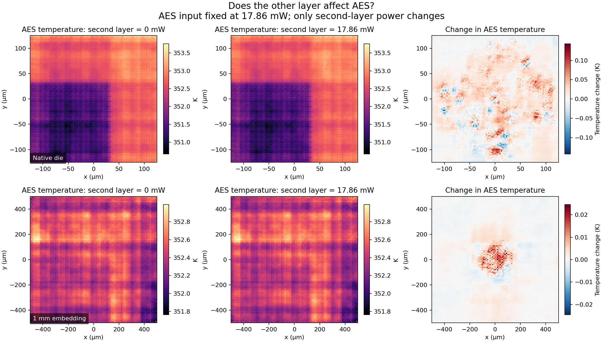

# Controlled layer-coupling test

Date: 2026-09-30. Tests the saved checkpoint, not physical accuracy.

## Intervention

Held every AES-layer input and both layers' coordinates fixed. Changed only second-layer power: zero, 0.5×, 1×, 2× the AES power map, plus a horizontally flipped 1× map. Repeated the zero case. Ran both original coordinate domains using archived model source, weights, statistics, and inference code.

## Results

| Domain | Second-layer power (mW) | AES mean temperature change (K) | Largest absolute local change (K) |
|---|---:|---:|---:|
| native_die | 0.00000 | +0.00000000 | 0.00000000 |
| native_die | 8.92769 | +0.00510708 | 0.07161468 |
| native_die | 17.85539 | +0.01020001 | 0.14291424 |
| native_die | 35.71078 | +0.02055190 | 0.27519306 |
| benchmark_1mm_embedding | 0.00000 | +0.00000000 | 0.00000000 |
| benchmark_1mm_embedding | 8.92769 | +0.00025838 | 0.01237604 |
| benchmark_1mm_embedding | 17.85539 | +0.00053495 | 0.02459218 |
| benchmark_1mm_embedding | 35.71078 | +0.00110004 | 0.04841381 |

All changes are relative to the same-domain zero-power second layer. These are changes in model predictions, not errors relative to true temperatures.

Both baseline predictions match the archived AES results bitwise; duplicate zero-input runs are also bitwise equal. All output values are finite. The recorded input assertions ensure the AES input and coordinate channels stayed unchanged.

## Interpretation and limits

A nonzero AES response to the second-layer intervention demonstrates that the two outputs are not independent of the other layer's power input in this checkpoint. It does not prove that the learned coupling is physically accurate.

Zero heat generation does not remove a layer. After the saved normalization, raw zero power in slot 1 becomes approximately -0.60822, not a masked/missing channel. Geometry, materials and cooling also remain implicit in this adapted checkpoint.

This test cannot quantify adding a passive layer versus having no second layer: those are different physical stacks. That comparison needs matched solver cases (with/without that layer under explicitly defined boundaries), followed by appropriately adapted models if using Therm-FM. The unchanged checkpoint requires eight channels.

The equal/flipped cases additionally probe spatial dependence at the same total power. They are synthetic input interventions, not newly routed designs. Exact metrics and all model provenance are in coupling_report.json and predictions/inference_report.json.



## Reproduce

```bash
python scripts/check_layer_coupling.py --root /absolute/path/to/aes_thermfm
```

Use the archived compatible inference environment; this needs Torch, Transformers, NumPy, h5py and Matplotlib. The script writes only its experiment directory and this generated report.
